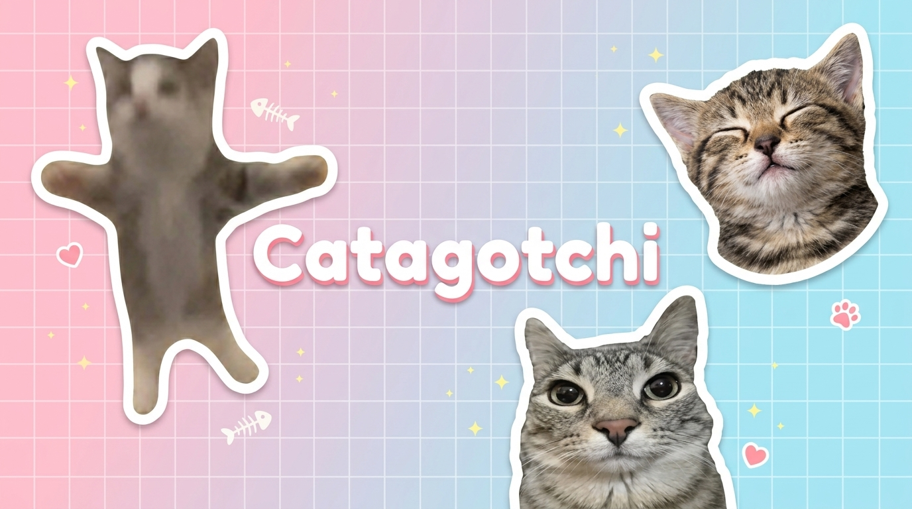
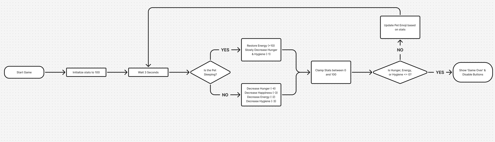

# Catagotchi (Virtual Pet)



Catagotchi (formerly named *FurWatch*) is a desktop-based virtual pet simulator application built with **Python 3** and **Tkinter**. The project demonstrates modular design principles, isolating the core game engine from dynamic styling theme engines and custom feature extensions.

---

## Features

* **Real-time Game Loop**: Drives the passive decay of stats (Hunger, Happiness, Energy, and Hygiene) on a 3-second non-blocking clock loop.
* **Optimized Dynamic Rendering**: Swaps between centered, transparent background PNG assets representing the pet's current need state. Assets are pre-scaled to `128x128` pixels for lightweight loading without runtime dependencies.
* **Native Theme Syncing**: Automatically detects Windows or macOS system theme preferences (Light/Dark Mode) and re-styles UI containers dynamically without restarting the application.
* **Modular Features Package**: Decouples optional additions into a separate `/features` package:
  * **Hard Mode**: Multiplies passive decay rates for added difficulty.
  * **Danger Alerts**: Visual and audio indicators warning when stats drop below critical levels.
  * **Smart Needs Advisor**: Recommends action buttons (Feed, Play, Clean, Sleep) in real time and prioritizes waking up sleeping pets first if other needs become critical.
  * **Auto-Save Persistence**: Periodically saves pet status to a local JSON file and reloads it on startup.
* **Game Restarts**: Allows starting fresh immediately after a game-over screen.

---

## Folder Structure

```text
pet-app/
├── main.py                   # Core game loop, stats decay manager, and GUI window
├── theme.py                  # Cross-platform dark/light mode detector and palette styling
├── assets/                   # Optimized 128x128 transparent PNG sprites
│   ├── happy.png, sad.png, sleeping.png, dirty.png, hungry.png, dead.png
├── features/                 # Modular extension pack
│   ├── __init__.py           # Dynamic importer and registration callback
│   ├── hard_mode.py          # Custom tick logic (double decay rate)
│   ├── danger_alert.py       # Non-blocking audio warning system
│   ├── recommendations.py    # Needs advisor highlighting controller
│   └── persistence.py        # State serialization and auto-save manager
├── stickers/                 # Outlined transparent PNG stickers of pet assets and memes
├── Catagotchi_Submission.ipynb # Academic project workbook and unit tests
├── Catagotchi.pptx           # Final presentation slides
└── README.md                 # Project instructions and documentation
```



---

## Getting Started

### Prerequisites

* Python 3.x
* Tkinter (standard library in Python, usually pre-installed. For Ubuntu/Debian, install via `sudo apt install python3-tk`).

*Note: Since the cat sprites are pre-optimized to `128x128` pixels, the application can be run directly using Python's standard library **without requiring Pillow (`PIL`) or any third-party dependencies at runtime!***

### Running the Application

To run the game, execute the core script:

```bash
python3 main.py
```

---

## Authors

* **Abhishek Sagar**
* **Jivko Katzarov**

---

## License

* **Project Source Code**: Licensed under the [MIT License](LICENSE).
